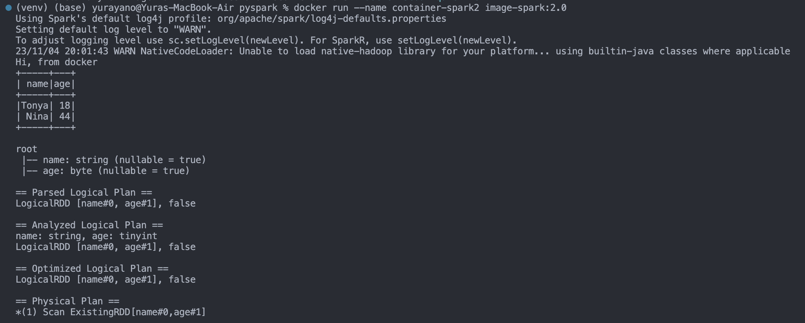
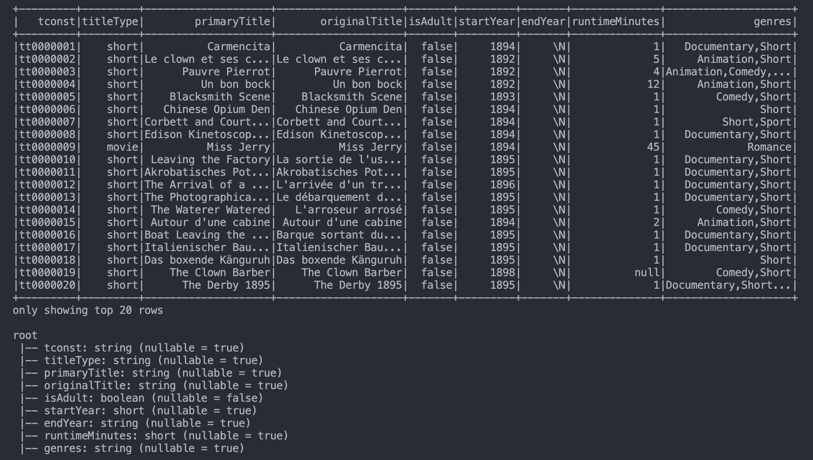
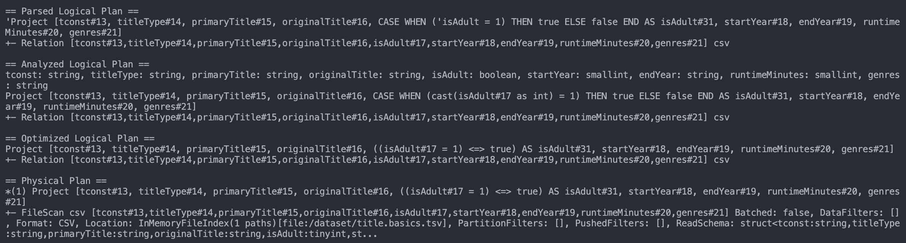

# PYSPARK PROJECT 
## Chosen dataset: **imdb**
## Participants:
    - Ostap Shcherbii     [CS-413]
    - Mykytyn Sofiia      [CS-413]
    - Molochii Viktoriia  [CS-415]
    - Yurii Yano          [CS-413]
    - Iryna Koval         [CS-413]
    - Vasyl Shponarskyi   [CS-413]

## Result of building image and running container:

PS: The structure of the project is not final (simply demo was published)

## Build image
docker build -t spark-image:1.0 .

## To run in debug-mode:

docker run -p 80:3000 --rm -v 'PATH_TO_A_FOLDER_WHERE_DOCKERFILE_IS_LOCATED:/app' --name container-spark-dev-mode spark-image:1.0 
